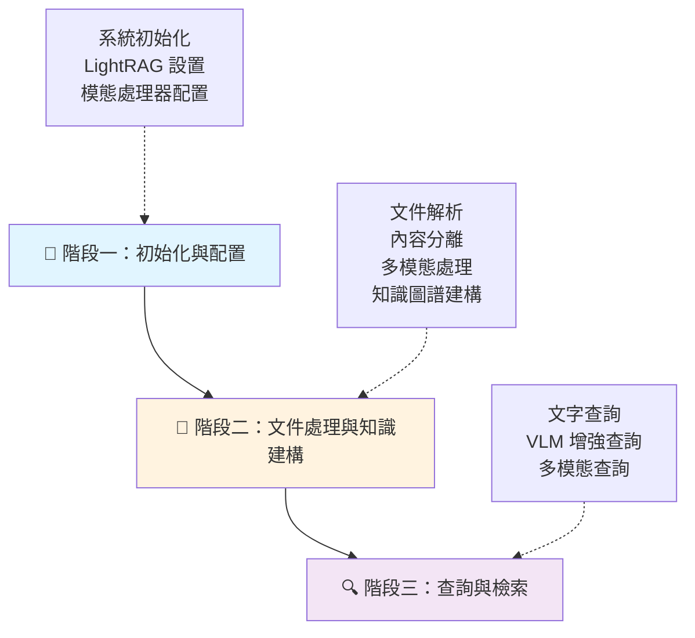
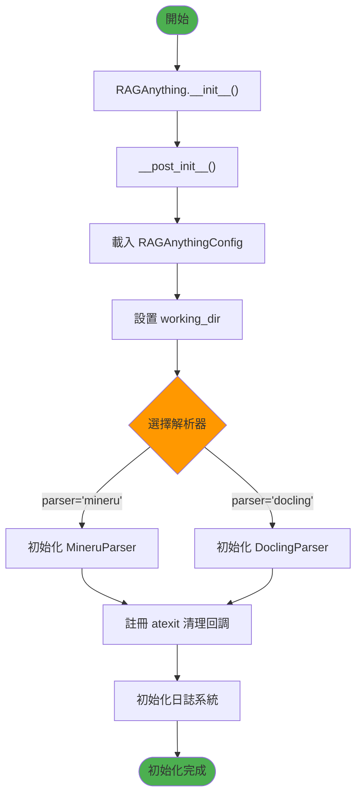
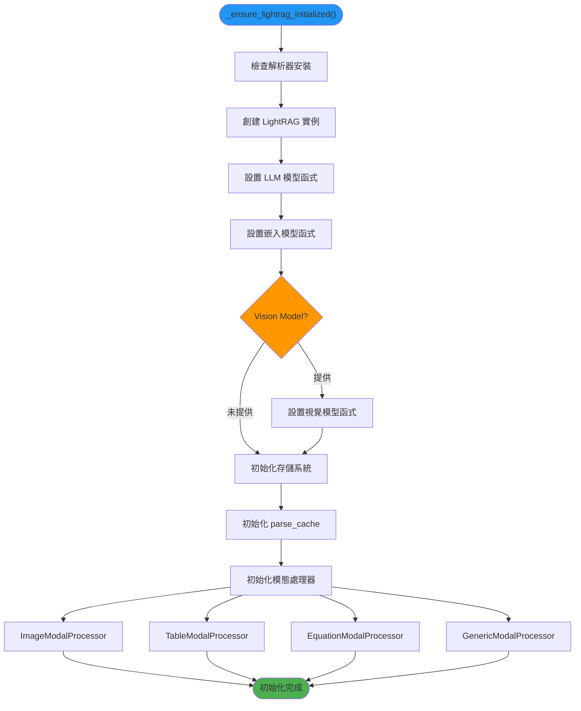
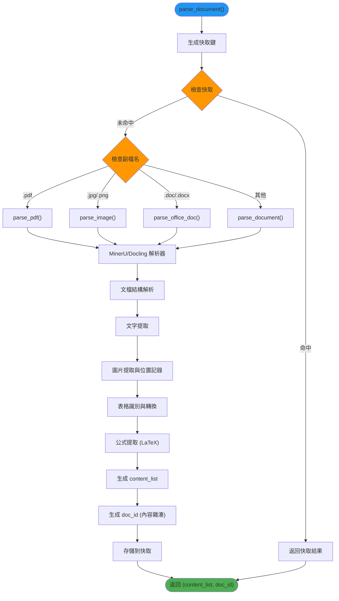
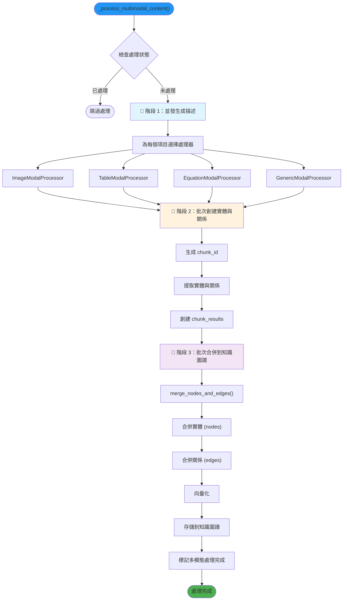
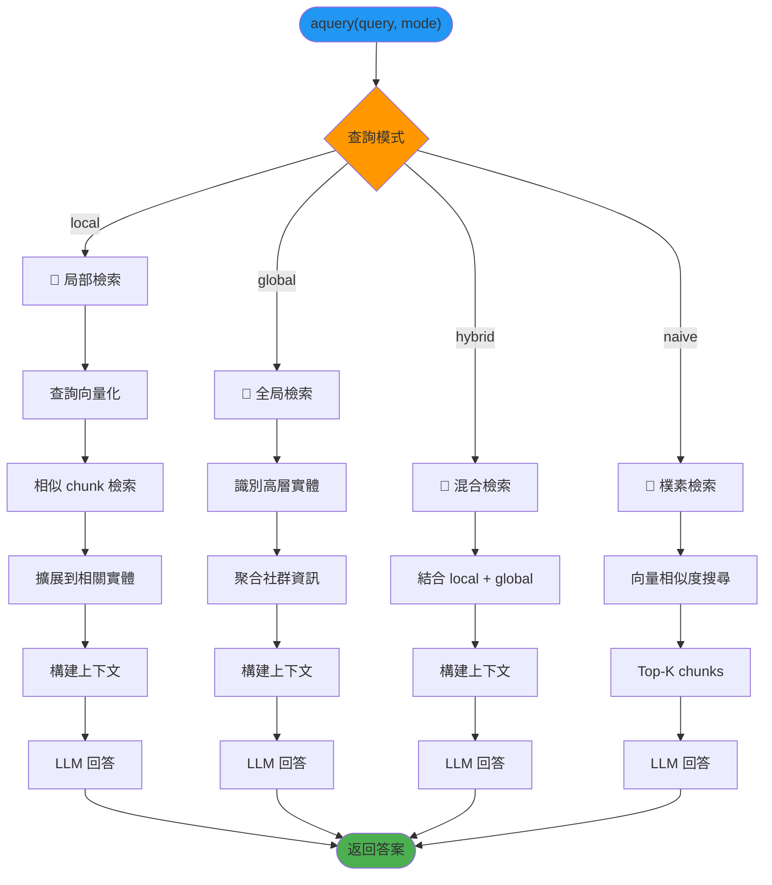
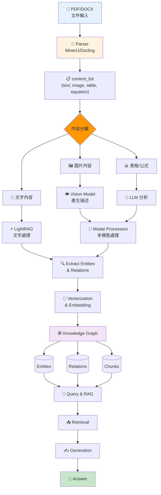

# RAG-Anything 完整工作流程

本文件詳細說明 RAG-Anything 從文件輸入到知識查詢的完整工作流程。

---

## 📋 總覽

RAG-Anything 的整體工作流程分為三個主要階段：



---

## 🚀 階段一：初始化與配置

### 1.1 系統初始化



**對應腳本：** `raganything/raganything.py` → `__post_init__()`

**關鍵步驟：**
1. 載入環境變數與配置檔
2. 創建工作目錄 `working_dir`
3. 根據配置選擇文件解析器（MinerU 或 Docling）
4. 初始化日誌系統

---

### 1.2 LightRAG 初始化



**對應腳本：** `raganything/raganything.py` → `_ensure_lightrag_initialized()`

**關鍵元件：**
- **LightRAG**: 核心知識圖譜引擎
- **Parse Cache**: 解析結果快取（避免重複解析）
- **Modal Processors**: 各類型內容的專門處理器

---

### 1.3 上下文提取器初始化

**執行流程：**

```python
_initialize_processors()
    ↓
_create_context_extractor()
    ├── 創建 ContextConfig
    │   ├── context_window (前後頁數/區塊數)
    │   ├── context_mode (page/chunk)
    │   ├── max_context_tokens (最大 token 數)
    │   └── 篩選設定
    └── 綁定 tokenizer (來自 LightRAG)
```

**對應腳本：** 
- `raganything/raganything.py` → `_create_context_extractor()`
- `raganything/modalprocessors.py` → `ContextExtractor`

**功能：**
為多模態內容提供周圍上下文，增強處理品質

---

## 📄 階段二：文件處理與知識建構

### 2.1 文件解析



**對應腳本：** 
- `raganything/processor.py` → `parse_document()`
- `raganything/parser.py` → `MineruParser`/`DoclingParser`

**輸出：**
- `content_list`: 解析後的內容列表
- `doc_id`: 文件唯一識別碼

---

### 2.2 內容分離

**執行流程：**

```python
separate_content(content_list)
    ├── 遍歷 content_list
    ├── 分類內容
    │   ├── 純文字內容 → text_content
    │   └── 多模態內容 → multimodal_items
    │       ├── image
    │       ├── table
    │       ├── equation
    │       └── 其他
    └── 返回 (text_content, multimodal_items)
```

**對應腳本：** `raganything/utils.py` → `separate_content()`

**目的：**
將純文字與多模態內容分開，以便採用不同的處理策略

---

### 2.3 文字內容處理

**處理流程：**

```
insert_text_content()
    ↓
LightRAG.ainsert()
    ├── 文字分塊 (Chunking)
    │   ├── chunk_token_size
    │   └── chunk_overlap_token_size
    │
    ├── 實體抽取 (Entity Extraction)
    │   └── 使用 LLM 識別命名實體
    │
    ├── 關係抽取 (Relationship Extraction)
    │   └── 使用 LLM 識別實體間關係
    │
    ├── 向量化 (Vectorization)
    │   ├── 文字塊向量化
    │   ├── 實體向量化
    │   └── 關係向量化
    │
    └── 存儲到知識圖譜
        ├── 向量資料庫
        ├── 圖資料庫
        └── KV 資料庫
```

**對應腳本：** 
- `raganything/utils.py` → `insert_text_content()`
- LightRAG 內部處理

**關鍵操作：**
1. 文字分塊確保不超過 token 限制
2. LLM 提取實體與關係
3. 嵌入模型生成向量表示
4. 建構知識圖譜

---

### 2.4 多模態內容處理



**對應腳本：** `raganything/processor.py`

---

#### 2.4.1 圖片處理細節

**ImageModalProcessor 流程：**

```
generate_description_only()
    ├── 提取上下文 (ContextExtractor)
    │   └── 獲取周圍頁面/區塊的文字
    │
    ├── 圖片編碼
    │   └── Base64 編碼
    │
    ├── 調用 Vision Model
    │   ├── 輸入：圖片 + prompt + 上下文
    │   └── 輸出：JSON 格式描述
    │       ├── detailed_description (詳細描述)
    │       ├── key_elements (關鍵元素)
    │       ├── spatial_relationships (空間關係)
    │       └── semantic_meaning (語義)
    │
    └── 創建實體資訊
        ├── entity_name (LLM 自動生成)
        ├── entity_type = 'image'
        └── source_id = 圖片路徑
```

**對應腳本：** `raganything/modalprocessors.py` → `ImageModalProcessor`

---

#### 2.4.2 表格處理細節

**TableModalProcessor 流程：**

```
generate_description_only()
    ├── 提取上下文
    │
    ├── 調用 LLM 分析表格
    │   ├── 輸入：表格內容 + caption + 上下文
    │   └── 輸出：JSON 格式分析
    │       ├── detailed_description (表格結構分析)
    │       ├── key_findings (關鍵發現)
    │       ├── data_patterns (數據模式)
    │       └── statistical_insights (統計洞察)
    │
    └── 創建實體資訊
```

**對應腳本：** `raganything/modalprocessors.py` → `TableModalProcessor`

---

#### 2.4.3 公式處理細節

**EquationModalProcessor 流程：**

```
generate_description_only()
    ├── 提取上下文
    │
    ├── 調用 LLM 分析公式
    │   ├── 輸入：LaTeX 公式 + 上下文
    │   └── 輸出：JSON 格式分析
    │       ├── detailed_description (數學意義)
    │       ├── variables_explanation (變數說明)
    │       ├── application_context (應用場景)
    │       └── related_concepts (相關概念)
    │
    └── 創建實體資訊
```

**對應腳本：** `raganything/modalprocessors.py` → `EquationModalProcessor`

---

### 2.5 實體與關係抽取

**處理流程：**

```
_create_entity_and_chunk_batch()
    ├── 為每個描述結果
    │   ├── 創建 chunk
    │   │   ├── chunk_id = compute_mdhash_id(content)
    │   │   ├── full_doc_id = doc_id
    │   │   ├── content = 格式化的描述文字
    │   │   └── 元資料 (page_idx, type, etc.)
    │   │
    │   └── 提取實體與關係
    │       └── extract_entities()
    │           ├── 使用 LLM 提取實體
    │           ├── 使用 LLM 提取關係
    │           └── 返回 (nodes, edges)
    │
    └── 返回所有 chunk_results
```

**對應腳本：** `raganything/modalprocessors.py` → `BaseModalProcessor`

**關鍵：**
- 每個多模態內容都會創建一個 chunk
- chunk 與原文件（doc_id）關聯
- 從增強描述中提取知識圖譜節點與邊

---

### 2.6 知識圖譜合併

**執行流程：**

```
merge_nodes_and_edges()
    ├── 處理所有 chunk_results
    │   ├── 合併實體 (nodes)
    │   ├── 合併關係 (edges)
    │   └── 去重與衝突解決
    │
    ├── 向量化
    │   ├── 實體嵌入
    │   └── 關係嵌入
    │
    └── 存儲
        ├── 向量資料庫 (entities_vdb, relationships_vdb)
        ├── 圖資料庫 (chunk_entity_relation_graph)
        ├── 完整實體資料 (full_entities)
        └── 完整關係資料 (full_relations)
```

**對應腳本：** LightRAG → `lightrag/operate.py`

---

### 2.7 文件狀態更新

**狀態追蹤：**

```
doc_status 更新
    ├── status: PROCESSING → PROCESSED
    ├── chunks_list: [chunk_id1, chunk_id2, ...]
    ├── chunks_count: 文字 chunk 數 + 多模態 chunk 數
    ├── multimodal_processed: true
    └── updated_at: 時間戳
```

**對應腳本：** `raganything/processor.py` → `_mark_multimodal_processing_complete()`

---

## 🔍 階段三：查詢與檢索

### 3.1 查詢類型

RAG-Anything 支援三種查詢模式：

#### 3.1.1 純文字查詢 (Text Query)



**對應腳本：** 
- `raganything/query.py` → `QueryMixin.aquery()`
- LightRAG 內部查詢邏輯

---

#### 3.1.2 VLM 增強查詢 (VLM Enhanced Query)

**執行流程：**

```
aquery_vlm_enhanced(query, mode)
    ├── 使用 LightRAG 檢索文字上下文
    │   └── 包含圖片路徑引用
    │
    ├── 處理圖片路徑
    │   └── _process_image_paths_for_vlm()
    │       ├── 提取所有  格式
    │       ├── 驗證圖片檔案
    │       ├── Base64 編碼
    │       └── 添加 [IMAGE_N] 標記
    │
    ├── 構建 VLM 訊息格式
    │   └── _build_vlm_messages_with_images()
    │       ├── system prompt
    │       ├── 檢索到的上下文 (含圖片標記)
    │       ├── 圖片內容 (base64)
    │       └── 用戶查詢
    │
    └── 調用 Vision Model
        └── 返回整合視覺與文字的回答
```

**對應腳本：** `raganything/query.py` → `QueryMixin.aquery_vlm_enhanced()`

**特點：**
- 自動檢測上下文中的圖片
- 將圖片發送給 VLM 進行視覺分析
- 結合文字與視覺資訊回答問題

---

#### 3.1.3 多模態查詢 (Multimodal Query)

**執行流程：**

```
aquery_with_multimodal(query, multimodal_content, mode)
    ├── 處理多模態內容
    │   └── _process_multimodal_query_content()
    │       ├── 為每個內容生成描述
    │       │   ├── 圖片 → Vision Model 描述
    │       │   ├── 表格 → LLM 分析
    │       │   ├── 公式 → LLM 解釋
    │       │   └── 通用 → LLM 描述
    │       │
    │       └── 增強查詢文字
    │           └── 原查詢 + 多模態內容描述
    │
    ├── 使用增強查詢檢索
    │   └── LightRAG.aquery(enhanced_query, mode)
    │
    └── 返回結果
```

**對應腳本：** `raganything/query.py` → `QueryMixin.aquery_with_multimodal()`

**使用場景：**
- 用戶提供特定的圖片/表格/公式
- 需要結合用戶提供的內容與知識庫回答

---

### 3.2 檢索機制

**混合檢索策略：**

```
Hybrid Retrieval
    ├── 向量相似度搜尋
    │   ├── Chunk 向量匹配
    │   ├── Entity 向量匹配
    │   └── Relationship 向量匹配
    │
    ├── 圖遍歷
    │   ├── 從匹配的 chunk 出發
    │   ├── 遍歷關聯的實體
    │   ├── 遍歷實體間關係
    │   └── 擴展到相關 chunk
    │
    └── 上下文融合
        ├── 文字內容
        ├── 實體資訊
        ├── 關係資訊
        └── 多模態內容描述
```

**優勢：**
- 結合語義相似度與結構化知識
- 保持多模態內容的關聯性
- 提供更全面的上下文

---

## 🔄 批次處理流程

### 批次文件處理

**執行流程：**

```
process_folder_complete(folder_path)
    ├── 掃描資料夾
    │   ├── 遞迴遍歷 (如果啟用)
    │   └── 篩選支援的檔案格式
    │
    ├── 並行處理
    │   └── 使用 ThreadPoolExecutor
    │       ├── max_workers 控制並發數
    │       │
    │       └── 對每個檔案
    │           ├── 解析文件
    │           ├── 處理內容
    │           └── 插入知識圖譜
    │
    ├── 進度追蹤
    │   └── 成功/失敗統計
    │
    └── 返回處理結果
```

**對應腳本：** 
- `raganything/batch.py` → `BatchMixin.process_folder_complete()`
- `raganything/batch_parser.py` → `BatchParser`

---

## 📊 資料流程圖

### 完整資料流



---

## 🎯 關鍵設計模式

### 1. 混入模式 (Mixin Pattern)

```python
class RAGAnything(QueryMixin, ProcessorMixin, BatchMixin):
    # 將功能模組化
    pass
```

**優勢：**
- 功能分離，易於維護
- 程式碼重用
- 靈活組合

---

### 2. 策略模式 (Strategy Pattern)

**多種解析器：**
- MineruParser
- DoclingParser

**多種模態處理器：**
- ImageModalProcessor
- TableModalProcessor
- EquationModalProcessor
- GenericModalProcessor

**優勢：**
- 可替換的演算法
- 擴展性強

---

### 3. 快取模式 (Cache Pattern)

**兩層快取：**
1. **解析快取** - 避免重複解析文件
2. **LLM 快取** - 避免重複 API 調用

**優勢：**
- 提升效能
- 降低成本

---

### 4. 批次處理模式 (Batch Processing)

**並發控制：**
- Semaphore 控制並發數
- ThreadPoolExecutor 並行處理

**優勢：**
- 提高吞吐量
- 資源控制

---

## 📝 配置參數影響

| 參數 | 影響階段 | 說明 |
|------|---------|------|
| `parser` | 文件解析 | 選擇 MinerU 或 Docling |
| `parse_method` | 文件解析 | auto/ocr/txt 模式 |
| `enable_image_processing` | 多模態處理 | 是否處理圖片 |
| `enable_table_processing` | 多模態處理 | 是否處理表格 |
| `enable_equation_processing` | 多模態處理 | 是否處理公式 |
| `context_window` | 上下文提取 | 前後頁數/區塊數 |
| `context_mode` | 上下文提取 | page 或 chunk 模式 |
| `max_context_tokens` | 上下文提取 | 最大 token 數 |
| `max_concurrent_files` | 批次處理 | 並發處理檔案數 |

---

## 🔧 錯誤處理機制

### 1. 解析失敗處理

```
parse_document() 失敗
    ├── MineruExecutionError → 記錄錯誤
    ├── 快取檢查失敗 → 繼續解析
    └── 內容為空 → 拋出 ValueError
```

### 2. 多模態處理失敗

```
批次處理失敗
    └── 降級到個別處理
        └── _process_multimodal_content_individual()
```

### 3. 狀態追蹤

```
doc_status 狀態機
    PENDING → PROCESSING → PROCESSED
                    ↓
                 (失敗)
                    ↓
                  FAILED
```

---

## 💾 存儲結構

### 知識圖譜存儲

```
working_dir/
├── kv_store_*          # KV 儲存 (文件狀態、chunk 等)
├── vdb_*               # 向量資料庫 (entities, relations)
├── graph_*             # 圖資料庫 (關係圖)
└── parse_cache/        # 解析快取
```

---

## 🎓 最佳實踐

1. **合理設置並發數**
   - `max_concurrent_files`: 根據記憶體大小調整
   
2. **啟用快取**
   - 避免重複解析相同文件
   
3. **選擇合適的上下文窗口**
   - 較大的窗口提供更多上下文，但消耗更多 token
   
4. **批次處理大量文件**
   - 使用 `process_folder_complete()` 而非逐個處理
   
5. **定期清理存儲**
   - 調用 `finalize_storages()` 確保資料持久化

---

## 📚 總結

RAG-Anything 的工作流程包含：

1. **初始化** - 配置系統與模型
2. **文件解析** - 提取文字與多模態內容
3. **內容處理** - 分類處理不同類型內容
4. **知識建構** - 提取實體關係，建構知識圖譜
5. **查詢檢索** - 混合檢索策略，整合多模態資訊

整個系統設計靈活、模組化，支援多種文件格式與查詢模式，是一個功能完整的多模態 RAG 解決方案。
